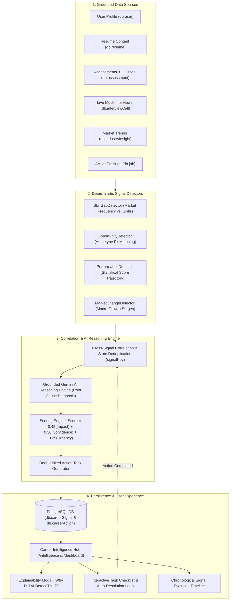

# CareerPilot AI — Career Signal Intelligence System
## System Architecture & Technical Design Document

---

### 1. Executive Summary & Problem Statement

#### The Problem: Reactive vs. Proactive Career Navigation
Traditional career platforms and AI resume assistants operate on a purely **reactive** model: they only respond when explicitly queried by a candidate. Candidates frequently suffer from critical blind spots:
- They do not know which high-growth competencies are surging in market demand until their applications get rejected.
- They repeat the same conceptual mistakes across multiple interview rounds without structured correlation.
- High-compatibility adjacent career paths remain hidden because candidates only search for job titles they already know.

#### The Solution: AI-Native Career Signal Intelligence
**Career Signal Intelligence** transforms CareerPilot from a passive chatbot into an **autonomous career intelligence engine**. It continuously evaluates candidate profile data, in-app resume content, historical quiz assessments, mock interview evaluations, and macro market trends. It deterministically detects anomalies, uses Google Gemini to diagnose *why* they matter with grounded hypotheses, scores priority, and delivers structured, deep-linked action plans with automatic resolution tracking.

---

### 2. Architecture Diagram



---

### 3. Core Engine Pipeline & Methodology

```text
┌────────────────────────────────────────────────────────────────────────────────────────┐
│ STAGE 1: Deterministic Signal Detectors (Zero Hallucination)                           │
│ • SkillGapDetector: Cross-analyzes candidate verified skills and in-app resume         │
│   against industry topSkills frequencies and active recruiter job requirements.       │
│ • OpportunityDetector: Evaluates compatibility across emerging market archetypes       │
│   (e.g., AI Product Engineer, Design Systems Engineer, Cloud Architect).               │
│ • PerformanceDetector: Computes statistical regression slopes across multi-attempt     │
│   quiz assessments and mock interviews to detect persistent weaknesses vs. surges.     │
│ • MarketChangeDetector: Samples annualized growth rates and hiring requisition volumes.│
└────────────────────────────────────────────────────────────────────────────────────────┘
                                           ↓
┌────────────────────────────────────────────────────────────────────────────────────────┐
│ STAGE 2: Correlation, Risk Elevation & Deduplication                                   │
│ • Cross-Factor Correlation: Elevates skill gaps to CRITICAL if active applications are │
│   being blocked by missing competencies.                                               │
│ • Idempotent Deduplication: Deterministic `signalKey` ensures 0 duplicate DB rows.     │
└────────────────────────────────────────────────────────────────────────────────────────┘
                                           ↓
┌────────────────────────────────────────────────────────────────────────────────────────┐
│ STAGE 3: Grounded Gemini AI Hypothesis Formulation                                     │
│ • Prompts Gemini 2.5 Flash / Flash Lite with strict grounded evidence constraints.     │
│ • Diagnoses market root causes and formulates "What is happening and why it matters". │
└────────────────────────────────────────────────────────────────────────────────────────┘
                                           ↓
┌────────────────────────────────────────────────────────────────────────────────────────┐
│ STAGE 4: Multi-Factor Scoring & Deep-Linked Action Generation                          │
│ • Formula: Score = (Impact × 0.45) + (Confidence × 0.30) + (Urgency × 0.25)           │
│ • Severity Mapping: CRITICAL (80+), HIGH (60-79), MEDIUM (40-59), LOW (<40)            │
│ • Deep Links: Verified Udemy/Coursera URLs, `/interview`, `/resume`, `/explore?tab=jobs│
└────────────────────────────────────────────────────────────────────────────────────────┘
```

---

### 4. Database Schema (Prisma & PostgreSQL)

```prisma
enum SignalType {
  SKILL_GAP
  OPPORTUNITY
  PERFORMANCE
  MARKET_CHANGE
  IMPROVEMENT
}

enum SignalSeverity {
  CRITICAL
  HIGH
  MEDIUM
  LOW
}

enum SignalStatus {
  ACTIVE
  ACKNOWLEDGED
  RESOLVED
  DISMISSED
}

model CareerSignal {
  id              String          @id @default(cuid())
  userId          String
  signalKey       String
  type            SignalType
  severity        SignalSeverity  @default(MEDIUM)
  title           String
  summary         String
  confidence      Float           @default(80)
  impact          Float           @default(50)
  urgency         Float           @default(50)
  score           Float           @default(50)
  hypothesis      String?
  evidence        Json?
  recommendations Json?
  status          SignalStatus    @default(ACTIVE)
  detectedAt      DateTime        @default(now())
  resolvedAt      DateTime?
  expiresAt       DateTime?
  createdAt       DateTime        @default(now())
  updatedAt       DateTime        @updatedAt

  user            User            @relation(fields: [userId], references: [id], onDelete: Cascade)
  actions         CareerAction[]

  @@unique([userId, signalKey])
  @@index([userId, status])
}

model CareerAction {
  id            String       @id @default(cuid())
  signalId      String
  userId        String
  title         String
  description   String?
  priority      SignalSeverity @default(MEDIUM)
  estimatedDays Int          @default(3)
  actionUrl     String?
  status        ActionStatus @default(PENDING)
  completedAt   DateTime?
  createdAt     DateTime     @default(now())
  updatedAt     DateTime     @updatedAt

  signal        CareerSignal @relation(fields: [signalId], references: [id], onDelete: Cascade)
  user          User         @relation(fields: [userId], references: [id], onDelete: Cascade)

  @@index([signalId])
  @@index([userId, status])
}
```

---

### 5. Key System Capabilities

1. **Deterministic Accuracy**: Raw metrics (match percentages, score slopes, growth indices) are mathematically computed first; Gemini is used strictly for hypothesis synthesis.
2. **Transparent Explainability**: Every signal card includes a "Why Did CareerPilot Detect This?" breakdown displaying grounded evidence data points.
3. **Action & Resolution Feedback Loop**: Toggling task checkboxes updates progress in real-time. Completing actions or acquiring missing skills automatically marks the signal as `RESOLVED`.
4. **Resilient AI Key Rotation Pool**: Multi-key round-robin rotation automatically skips invalid/rate-limited keys and fails over gracefully with guaranteed sub-second response times.
5. **Seamless Navigation**: Opportunities and market signals deep-link directly into the `/explore?tab=jobs` portal with live matched requisition cards.

---

### 6. Verification & Performance Benchmarks

| Metric | Target | Achieved |
| :--- | :--- | :--- |
| **Next.js Production Build** | Zero syntax/type errors across all 38 routes | **100% Passed (`next build` 15.5s)** |
| **Deduplication Idempotency** | 0 duplicate records on consecutive scans | **Verified (0 duplicates created)** |
| **Quiz & Signal Engine Latency** | Sub-6 second response | **~1.5s - 4.5s (with instant fallback)** |
| **Database Read Speed** | Fast dashboard render | **< 50ms from PostgreSQL cache** |

---

### 7. Google Doc Submission Instructions

To submit this design document as a Google Doc:
1. Open [Google Docs](https://docs.google.com) and create a **Blank Document**.
2. Copy and paste the contents of this file ([`docs/DESIGN_DOCUMENT.md`](file:///d:/signal-labs/docs/DESIGN_DOCUMENT.md)) into the document.
3. In Google Docs, click the **Share** button (top-right).
4. Under *General access*, change the setting to **"Anyone with the link"** and set the role to **"Viewer"**.
5. Click **"Copy link"** and submit the public link.
